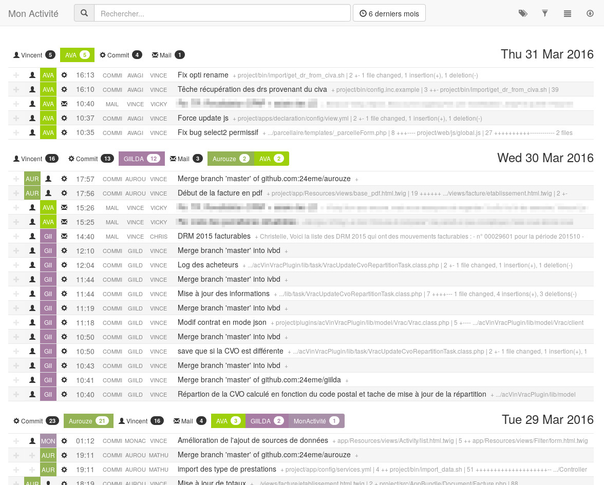
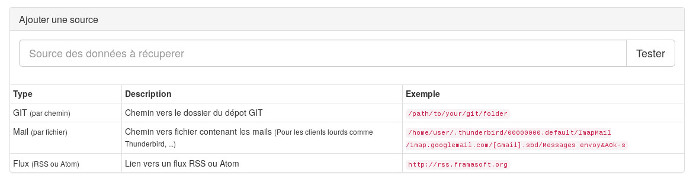

Mon Activité 
============

Mon activité est un outil pour récupérer son activité quotidienne à partir de mail, commit, flux RSS etc...

Installation
------------

Récupérer le projet

> git clone https://github.com/24eme/monactivite.git

### Dependances

Sous debian, voici les dépendances de librairies PHP7 :

 - php7.0-dom
 - php7.0-curl
 - php7.0-imap
 - php7.0-mbstring

### Installation simplifiée

Via la commande make, lancer simplement la commande

> make

### Installation pas à pas

Installation de composer (optionnelle si vous l'avez déjà installé en global)

> https://getcomposer.org/download/

Copier le fichier de configuration

> cp app/config/parameters.yml{.dump,}

Récupération des libairies externes via composer

> php composer.phar install

Création et construction de la base de données

> php app/console doctrine:database:create

> php app/console doctrine:schema:update --force

Chargement des données initiales

> php app/console doctrine:fixtures:load

### Lancer l'application

> php app/console server:start

Contribuer
----------

### Tests

Lancer les tests unitaires

> phpunit
