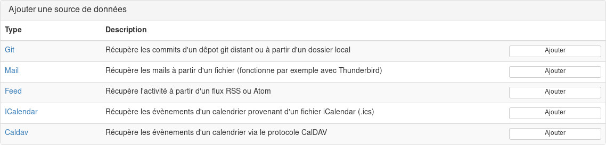

Mon Activité 
============

Mon activité est un outil pour récupérer son activité quotidienne à partir de mail, commit, flux RSS, calendrier etc...

Aperçu de l'interface de gestion des activités :

Sources de données :

Installation
------------

Récupérer le projet

    git clone https://github.com/24eme/monactivite.git

### Compatibilité

 - php 5.6
 - php 7.0
 - php 7.1
 - php 7.2
 - php 7.3

### Dépendances

Sous debian, voici les dépendances de librairies php :

 - php-curl
 - php-dom
 - php-imap
 - php-mbstring

Ainsi que la librairie de la base de données choisie :

 - php-sqlite3 (par défaut)
 - php-mysql
 - php-pgsql

### Installation automatisée

Lancer simplement la commande :

    make install

L'installation se fera avec sqlite, la bdd est stockée dans le fichier data/monactivite.db3

### Installation pas à pas

Installation de composer (optionnelle si vous l'avez déjà installé en global)

    https://getcomposer.org/download/

Copier le fichier de configuration

    cp app/config/parameters.yml{.dump,}

Récupération des libairies externes via composer

    composer install

Création et construction de la base de données

    php bin/console doctrine:database:create
    php bin/console doctrine:schema:update --force

Chargement des données initiales

    php bin/console doctrine:fixtures:load --append

### Lancer l'application

    php bin/console server:start

Contribuer
----------

### Tests

Lancer les tests unitaires

    make test

### Librairies et projets utilisés :

| Nom | Description | License |
|-----|-------------|---------|
| [Symfony 3](https://github.com/symfony/symfony/tree/3.4)| Framework PHP | MIT |
| [Doctrine](https://github.com/doctrine/orm)| ORM | MIT |
| [Twig](https://github.com/twigphp/Twig)| Moteur de template PHP | BSD-3-Clause |
| [Lasso Mail Parser](https://github.com/lassodatasystems/LassoMailParserBundle) | Parser de mail | LGPL-3.0 |
| [Html2Text](https://github.com/mtibben/html2text) | Convertisseur html vers texte | GPL-2.0-or-later |
| [VObject](https://github.com/sabre-io/vobject) | Parser et manipuler iCalendar | BSD-3-Clause |
| [simpleCalDAV](https://github.com/thecsea/simpleCalDAV) | Client caldav | GPL-2.0 |
| [PHP IMAP](https://github.com/barbushin/php-imap) | Manipuler des boîtes mails en IMAP | MIT |
| [PicoFeed](https://github.com/aaronpk/picofeed) | Lecteur de flux RSS/Atom | MIT |
